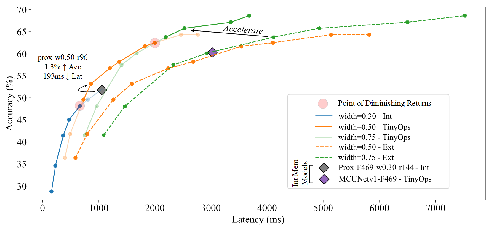

<div align="center">
  
# Enabling ImageNet-Scale Deep Learning on MCUs for Accurate and Efficient Inference

This is the __official__ code for the paper ["Enabling ImageNet-Scale Deep Learning on MCUs for Accurate and Efficient Inference"](https://ieeexplore.ieee.org/abstract/document/10314415/).

## About

We find that conventional approaches in TinyML that only utilise internal storage and memory yield low accuracy and, surprisingly, high latency. We develop the TinyOps inference framework which utilises external memories and DMA based operation partitioning to open a new model design space for MCUs. We derive efficient models from the TinyOps design space which outperform internal memory models with up to 6.7% higher accuracy and 1.4x faster inference latency, demonstrating the strength of the TinyOps design space.



</div>

## Model Zoo

| **Platform** |        **Model**       | **Design<br />Space** | **MACs<br />(M)** | **Params<br />(M)** | **Acc<br />(%)** | **Latency<br />(ms)** |       **Link**      |
|:------------:|:----------------------:|:----------------:|:------------:|:--------------:|:-----------:|:----------------:|:-------------------:|
|   **F469**   |  Proxyless<br />w0.30-r144  |     Internal     |      21      |      0.72      |     50.7    |       1089       | [json](https://drive.google.com/file/d/1wxAd5Ps5M3cCiWqoSUoAEnBvl4Jf7ssX/view?usp=sharing)<br />[tflite](https://drive.google.com/file/d/1hq2FENkwU-HCwJTftbrL24LDtrVAh1qU/view?usp=sharing) |
|   **F469**   |     MbV3<br />w0.50-r112    |      TinyOps     |      16      |      1.33      |     52.4    |        674       | [json](https://drive.google.com/file/d/1kz8anQfY_NrL48kpp8Tl790b6u2ZO5Wm/view?usp=sharing)<br />[tflite](https://drive.google.com/file/d/1n7pW-OuLCWEAmCeWKSFpO8n8vVCDf50F/view?usp=sharing) |
|   **F469**   |     MCUNetV1<br />(F469)    |     Internal     |      67      |      0.73      |     59.5    |       2980       | [json](https://drive.google.com/file/d/13bv7VhDGFc39rzCzDN9SMMn5QzKPBaIu/view?usp=sharing)<br />[tflite](https://drive.google.com/file/d/1FJx9EzEONe37YZ10L2Q_yHQ-pwueANZK/view?usp=sharing) |
|   **F469**   |   MNASNet<br />(w1.00-r80)  |      TinyOps     |      48      |      4.38      |     60.8    |       2146       | [json](https://drive.google.com/file/d/1yMj5pK1p6--BfrN8lwNwrEq2jb8w_dOq/view?usp=sharing)<br />[tflite](https://drive.google.com/file/d/1wCjnUVhGckwVto9oZsfhMeKUyyzDlmdg/view?usp=sharing) |
|   **F469**   |    MbV3<br />(w0.75-r128)   |      TinyOps     |      44      |      2.49      |     62.6    |       1442       | [json](https://drive.google.com/file/d/1RqrLURP3XVg90ihGiya6LqtEq5SZ2_zY/view?usp=sharing)<br />[tflite](https://drive.google.com/file/d/1N-nCokhzvzgEM_JKfY_EGNZ0kOW_Anfi/view?usp=sharing) |
|   **F469**   |    MbV3<br />(w1.00-r160)   |      TinyOps     |      111     |      3.96      |     68.2    |       3472       | [json](https://drive.google.com/file/d/1a1dTOCxMmnB32xmlOUrzAAKESF2bf2G0/view?usp=sharing)<br />[tflite](https://drive.google.com/file/d/17O2tmDDXPeIO8Sm015APFBNJOcLjOb7r/view?usp=sharing) |
|   **F746**   | Proxyless<br />(w0.30-r176) |     Internal     |      32      |      0.72      |     53.7    |        686       | [json](https://drive.google.com/file/d/1_eXQNBAk07hBnueCzA_zQCYw9KxJAj0R/view?usp=sharing)<br />[tflite](https://drive.google.com/file/d/10FMiSDorM8goqMyiRgvnTvWd95-wZwkL/view?usp=sharing) |
|   **F746**   |    MbV3<br />(w0.55-r128)   |      TinyOps     |      28      |      1.55      |     58.3    |        460       | [json](https://drive.google.com/file/d/1p0xThFea9N-vsNDi_HgZxnHgbiSk-9CC/view?usp=sharing)<br />[tflite](https://drive.google.com/file/d/1eZ1TLrmcOtMvC2p08K3N5jwmm7XlFjyF/view?usp=sharing) |
|   **F746**   |     MCUNetV1<br />(F746)    |     Internal     |      82      |      0.74      |     61.5    |       1838       | [json](https://drive.google.com/file/d/12Yk47OJzJzoWPehTiDtqChkq6p9XseFA/view?usp=sharing)<br />[tflite](https://drive.google.com/file/d/1xuLbEygH1CmDrwSXYWLBB2TOH3sH_pBF/view?usp=sharing) |
|   **F746**   |  MNASNet<br />(w1.00-r128)  |      TinyOps     |      104     |      4.38      |     68.0    |       1367       | [json](https://drive.google.com/file/d/15yY5DB4EloYYwkLo_-oxlx_QkNESOA7H/view?usp=sharing)<br />[tflite](https://drive.google.com/file/d/1rXvwsw28-AKsn7l2JQSpxcp6lmXf6UJa/view?usp=sharing) |
|   **F746**   |    MbV3<br />(w1.00-r160)   |      TinyOps     |      111     |      3.96      |     68.2    |       1307       | [json](https://drive.google.com/file/d/1a1dTOCxMmnB32xmlOUrzAAKESF2bf2G0/view?usp=sharing)<br />[tflite](https://drive.google.com/file/d/17O2tmDDXPeIO8Sm015APFBNJOcLjOb7r/view?usp=sharing) |

## Training, Quantisation

We trained our models in PyTorch, followed by standard INT8 post training quantisation using Tensorflow

### Requirement

- Python 3.6+
- PyTorch 1.4.0+
- Tensorflow 1.15

To train the models, run

```bash
python 
-u Train.TinyOps.TfPad/imagenet.py 
-a proxyless 
-d datasets/imagenet_2012/ 
--epochs 150 
--lr-decay cos 
--lr 0.05 
--wd 4e-5 
--net_config mbv3-w0.50-r128.json 
-c mbv3-w0.50-r128/
```

The models trained in PyTorch can then be quantised using standard post-training INT8 quantisation in tensorflow by running

```bash
python 
-u Train.TinyOps.TfPad/gen_eval_tflite.py --tflite_path mbv3-w0.55-r128_int8.tflite 
--train_dir imagenet_2012/train 
--val_dir imagenet_2012/val 
--cfg_path mbv3-w0.55-r128.json 
--ckpt_path mbv3-w0.55-r128/model_best.pth.tar


```

## Model Deployment

We ported the TinyOps inference framework and derived models for ARM Cortex M4 and M7 based MCU devices below which were supplemented with 8MB of SDRAM and NORFlash as below.

STM32F412 (Cortex-M4, 256kB SRAM/1MB Flash), 
STM32F746 (Cortex-M7, 320kB SRAM/1MB Flash)

The project directories for either MCU can be found in `STM32469I_DISCO_PO_TFLM/` and `STM32F746NG_DISCO_MINIMAL_CMSIS/` which can be imported into STM32CubeIDE (>v1.6.1).

Quantised TfLite models can be deployed with the TinyOps inference framework by converting the *.tflite files to [C arrays](https://www.tensorflow.org/lite/microcontrollers/build_convert) which are copied into the project directory.

Please refer to `STM32F746NG_DISCO_MINIMAL_CMSIS/Core/Src/tensorflow/lite/micro/examples/hello_world/Validated_Models/ImgNet_Models/mbv3-w1.00-r160_int8_1.cc` for model naming convention to be used.

